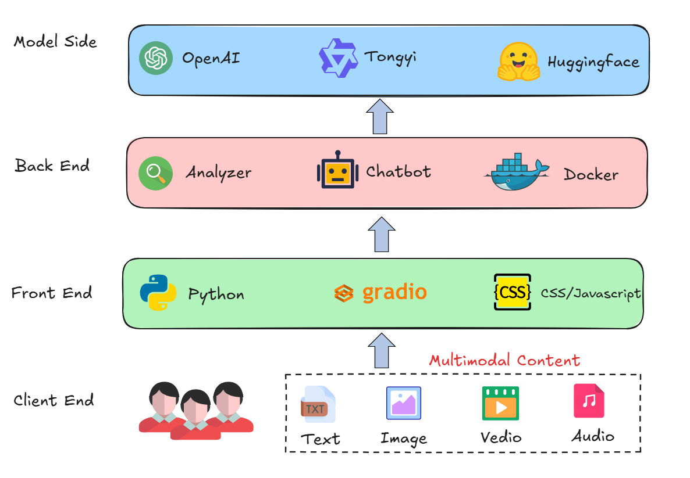
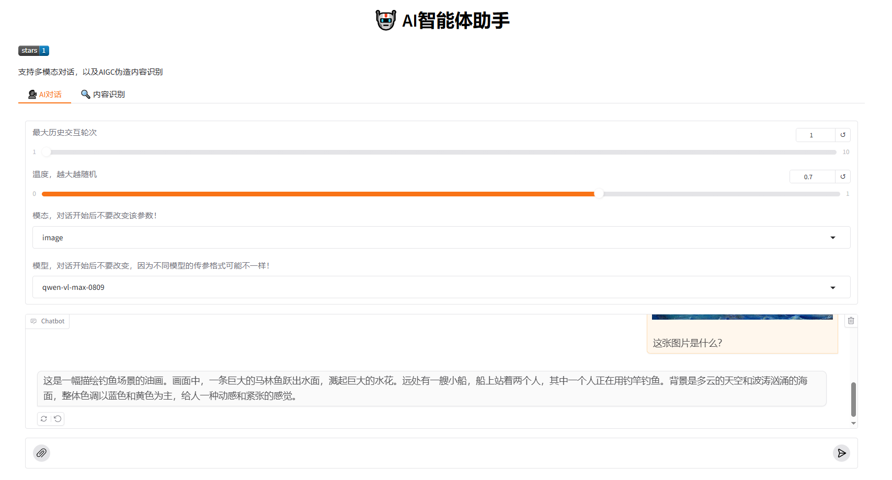
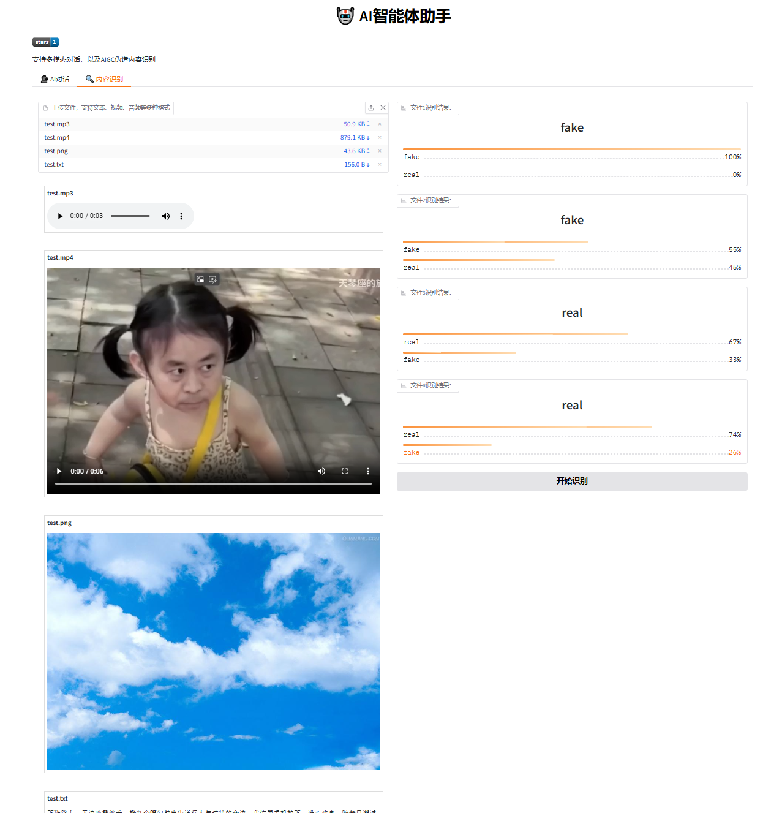

# 基于Gradio构建的智能AI助手

基于Gradio构建的简易支持多模态对话和AI伪造内容识别助手。


## ⚠️ 注意！！！

本项目仅供学习参考，伪造内容识别不具有任何现实指导意义！！！

+ 多模态对话模型：`qwen-long`、`qwen-vl-max-0809`、`qwen-audio-turbo`

+ 文本识别模型：`ayZhou/e5-small-lora-ai-generated-detector`

+ 图片识别模型：`umm-maybe/AI-image-detector`

+ 音频识别模型：`weights_Deep4SNet`

+ 视频识别模型：`dima806/deepfake_vs_real_image_detection`

> **important！！！**
> 由于使用的音频识别模型`Deep4SNet`基于的`tensorflow`版本过低，导致在现行`tensorflow`运行过程中可能会报错，请自行修改或更换模型！

## 🎁 更新

+ 2024.10.26 修复了一个bug，在使用`text`模式时，会出现`AttributeError: 'NoneType' object has no attribute 'text'`的错误。
- [ ] [TODO] 构建更完善的配置文件，支持不同识别模型，更美观的界面。

- [x] [2025/1/9] 初步构建Dockerfile, 支持Docker部署

- [x] [2025/1/7] 完成了视频、音频、图片的伪造内容识别分析

- [x] [2025/1/4] 更新了Gradio逻辑和界面，支持多文件上传

- [x] [2025/1/1] 完成了多模态AI对话、文本内容分析

- [x] [2024/12/30] 初步构建Gradio界面


**!!!本项目计划用作xjtu 2024秋 数据库系统原理及应用大作业，使用时请注意甄别。**

+ 支持多模态大预言模型对话
+ 支持不同模态AIGC伪造内容识别



# 📌 安装虚拟环境
```bash
conda create -n ai_helper python=3.12

conda activate ai_helper

pip install -r requirements.txt
```

# 📋 配置环境变量

将目录下`env_template`复制一份，重命名为`.env`（注意前面有点），然后修改：
```bash
# 设置hf-endpoint，加速模型下载访问
HF_ENDPOINT='https://hf-mirror.com'

# 设置openai key和base url，如不使用对话功能可忽略
OPENAI_API_KEY="sk-xx"
OPENAI_BASE_URL="https://dashscope.aliyuncs.com/compatible-mode/v1"

# gradio上传文件的临时目录，建议如下设置（即当前目录下tmp文件夹），否则会存到系统盘
GRADIO_TEMP_DIR="./tmp"

# 显示star数的小组件
SHEILDS_START_URL="https://img.shields.io/github/stars/HuiyuanYan/gradio_ai_helper?style=plastic"
```

# ⏰ 运行
```bash
python src/main.py
```
然后按照输出访问对应地址即可。

两种模式的效果展示如下：



