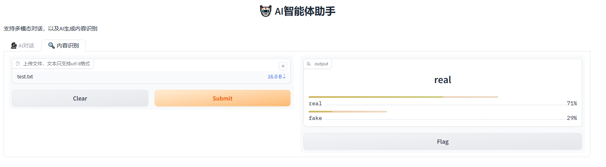

# 安装虚拟环境
```bash
conda create -n ai_helper python=3.12

conda activate ai_helper

pip install -r requirements.txt
```

# 配置环境变量

将目录下`env_template`复制一份，重命名为`.env`（注意前面有点），然后修改：
```bash
# 设置hf-endpoint，加速模型下载访问
HF_ENDPOINT='https://hf-mirror.com'

# 设置openai key和base url，如不使用对话功能可忽略
OPENAI_API_KEY="sk-xx"
OPENAI_BASE_URL="https://dashscope.aliyuncs.com/compatible-mode/v1"

# gradio上传文件的临时目录，建议如下设置（即当前目录下tmp文件夹），否则会存到系统盘
GRADIO_TEMP_DIR="./tmp"
```

# 运行
```bash
python src/main.py
```
然后按照输出访问对应地址即可。

两种模式的效果展示如下：




# 补全代码
补全不同文件格式的analyze，请参考`src\analyzer\text_analyzer.py`里的实现，主要实现的是类下面的`_analyze`方法。

然后可以自己上传一小段文件到test_files，并在网页中上传，测试一下效果。